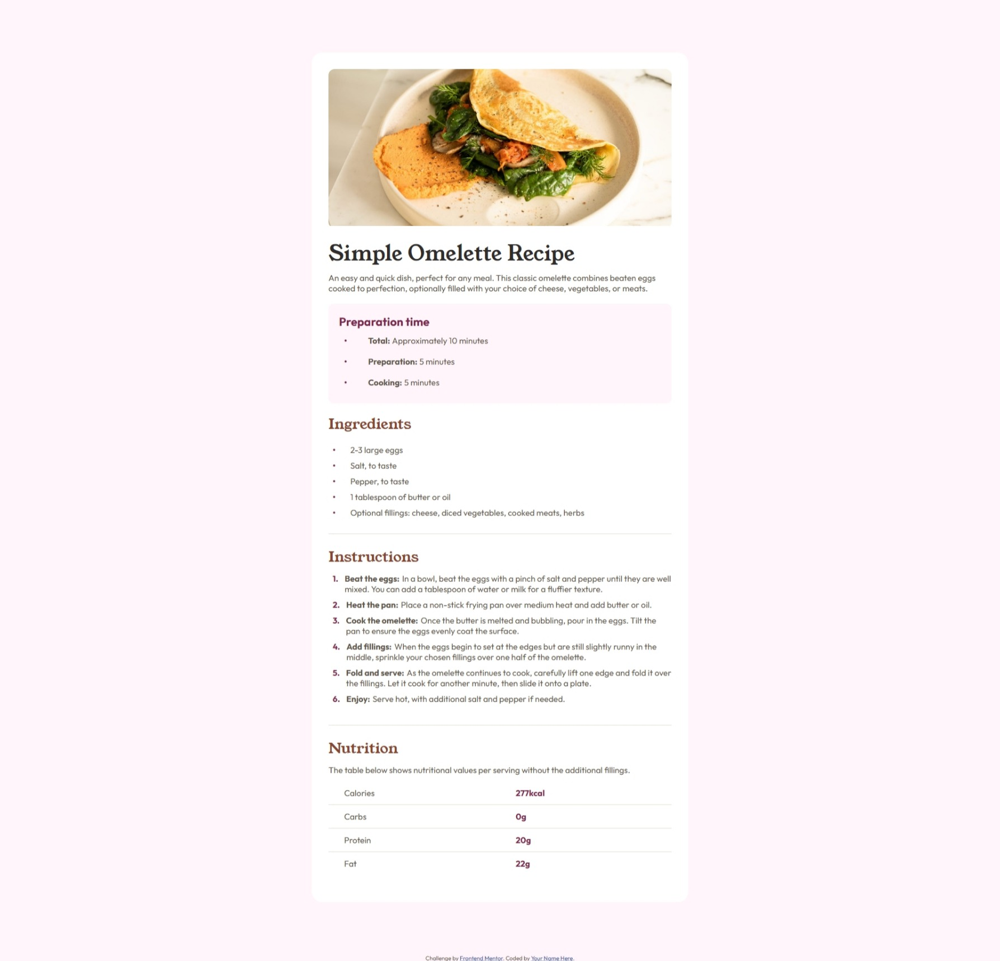

# Frontend Mentor - Recipe page solution

This is a solution to the [Recipe page challenge on Frontend Mentor](https://www.frontendmentor.io/challenges/recipe-page-KiTsR8QQKm). Frontend Mentor challenges help you improve your coding skills by building realistic projects. 

## Table of contents

- [Overview](#overview)
  - [The challenge](#the-challenge)
  - [Screenshot](#screenshot)
  - [Links](#links)
- [My process](#my-process)
  - [Built with](#built-with)
  - [What I learned](#what-i-learned)
  - [Continued development](#continued-development)
- [Author](#author)
- [Acknowledgments](#acknowledgments)


## Overview
Welcome to your very own Simple Omelette Recipe Page—the ultimate guide to creating a quick and delicious meal that's perfect for any time of day! This beautifully structured page walks readers through every step of the journey, from preparation to serving, ensuring that even beginners can whip up a fluffy and flavorful omelette with confidence.

### Screenshot



### Links

- Solution URL: [View the source code](https://github.com/FA23BCS233/Omellate-Reciepe)
- Live Site URL: [Veiw Live Site](https://your-live-site-url.com)

## My process

  First step of the creation is analyze and I follow it too. I Analyze how could I break this page into different section maintaining the sementics and accessibility. I wrote down the way to organize my HTML which made the markup process really fast I had not to revisit the HTML while styling the page. I styled all the section to make them as close as I can to resemble the given design of the page. I am hopefull to improve my skills and continue to polish my coding and structuring techniques.

### Built with

- Semantic HTML5 markup
- CSS custom properties
- Flexbox

### What I learned

In designing the page I came across the problem where I struct how to maintain the both desing and sementics at the same time. In my project, I faced a challenge with the display of a <dl> (definition list) containing <dt> (definition term) and <dd> (definition description). By default, browsers display <dt> and <dd> as block-level elements, causing <dd> to appear on a new line below <dt>. However, I needed <dt> and <dd> to flow naturally in the same line while keeping the structure semantically correct and accessible.

To solve the problem:
 - I applied display: none to <dt> to visually hide it while keeping it accessible for screen readers.
 - I added a <span> inside <dd> to display the term (e.g., "Step 1:") in the flow of the description.
 - I styled the <span> using CSS to resemble the hidden <dt>'s purpose while maintaining control over the visual presentation.

Here is code to solve the above problem
```html
<section class="intructions">
      <h2>Instructions</h2>
      <dl>

        <div>
          <dt>Beat the eggs:</dt>
          <dd><span role="none">Beat the eggs:</span>In a bowl, beat the eggs with a pinch of salt and pepper until they are well mixed. You can add a
            tablespoon of water or milk for a fluffier texture.</dd>
        </div>

        <div>
          <dt>Heat the pan:</dt>
          <dd><span role="none">Heat the pan:</span>Place a non-stick frying pan over medium heat and add butter or oil.</dd>
        </div>

        <div>
          <dt>Cook the omelette:</dt>
          <dd><span role="none">Cook the omelette:</span>Once the butter is melted and bubbling, pour in the eggs. Tilt the pan to ensure
            the eggs evenly coat the surface.</dd>
        </div>

        <div>
          <dt>Add fillings (optional):</dt>
          <dd><span role="none">Add fillings:</span>When the eggs begin to set at the edges but are still slightly runny in the middle, sprinkle your chosen
            fillings over one half of the omelette.</dd>
        </div>

        <div>
          <dt>Fold and serve:</dt>
          <dd><span role="none">Fold and serve:</span>As the omelette continues to cook, carefully lift one edge and fold it over the
            fillings. Let it cook for another minute, then slide it onto a plate.</dd>
        </div>

        <div>
          <dt>Enjoy:</dt>
          <dd><span role="none">Enjoy:</span>Serve hot, with additional salt and pepper if needed.</dd>
        </div>
      </dl>
</section>
```
```css

.intructions dl{
    counter-reset: instruction-counter;
    padding-left: 8px ;
    margin-top: 12px;
}

.intructions dl > div{
    counter-increment: instruction-counter;
    display: flex;
    align-items: flex-start;
    margin-bottom: 10px;
}

.intructions  dt{
    display: none;
}

.intructions dl div dd span{
    font-weight: bold;
    color: var(--stone-600);
    margin-right: 5px;
}

.intructions dl  div::before{
    content: counter(instruction-counter) ".";
    margin-right: 12px;
    font-weight: 700;
    color: var(--rose-800);
}
```

### Continued development

I will countinue to develope a few more HTML and CSS dedicated project before going deep into the JS. Then explore the libraries like the React and Three JS although I already have skilled in these but I lack confidence because of not making the projects consistently. There is the tip for the new comming to remain consistent and make the projects to polish their skills

## Author

- Name - [Muhammad Arham](#)
- Frontend Mentor - [@fa23bcs233](https://www.frontendmentor.io/profile/fa23bcs233)
- GitHun - [Muhammad Arham](https://github.com/FA23BCS233)
## Acknowledgments

For making this project and knowing if was sementically correct I used the copilot which helped me a lot to make the project done with the great efficiency.

